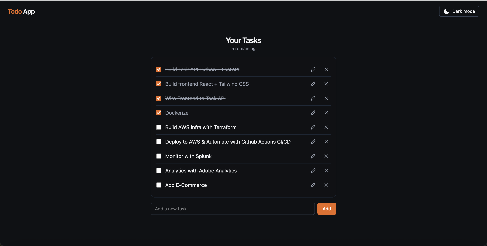
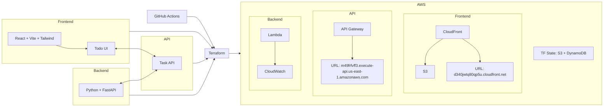

# Multicloud DevOps Demo

Simple Todo app to show a full stack:

- Backend: FastAPI Tasks API (Python; Uvicorn locally, Lambda in prod)
- Frontend: React + Vite + Tailwind single‑page app
- API hosting: AWS Lambda behind API Gateway with CORS locked to CloudFront
- Frontend hosting: AWS S3 + CloudFront (global CDN) with short‑cache index.html
- Infrastructure: Terraform IaC with S3 remote state + DynamoDB lock
- CI/CD: GitHub Actions (OIDC to AWS) builds lambda.zip, applies Terraform, builds frontend, syncs S3, invalidates CloudFront, and probes /health
- Health: lightweight GET /health liveness endpoint used in CI and for uptime checks
- Analytics: Plausible pageviews + custom events (task_created/completed/deleted/edited)
- Monitoring: CloudWatch Logs; ready to forward to Splunk
- Local dev: Docker Compose (Nginx frontend + Uvicorn backend); tasks persist to a JSON file

## Preview



## Live URLs

- Frontend (CloudFront): https://d340jwtq80qp5u.cloudfront.net/
- API (API Gateway): https://m49frfvff3.execute-api.us-east-1.amazonaws.com

## Architecture

The app is a small full‑stack deployed to AWS with Terraform and GitHub Actions.



## Delivery Timeline (Sprints)

- Sprint 1: Backend + API
  - FastAPI Tasks API with health and CRUD endpoints
  - JSON persistence (local file) and Mangum handler for Lambda
- Sprint 2: Frontend
  - React + Vite + Tailwind SPA (dark theme, optimistic UI updates)
  - Clean components and minimal state, API client stub
- Sprint 3: Wire API between front and back
  - VITE_API_BASE and dev proxy; error handling and retries
  - CORS configured in FastAPI; validated with browser and curl
- Sprint 4: Infrastructure as Code (Terraform on AWS)
  - S3 (static site), CloudFront (OAC), API Gateway (HTTP API), Lambda, IAM
  - Remote state (S3) + optional DynamoDB lock; outputs for API/CDN/ bucket
- Sprint 5: CI/CD (GitHub Actions)
  - OIDC AssumeRole; build lambda.zip via SAM image; terraform init/apply
  - Build frontend with VITE_API_BASE from TF output; S3 sync; CF invalidate
  - Sanity steps: backend resources, API health probe, bundle URL check, CORS preflight
- Sprint 6: Analytics
  - Plausible integration pattern documented; ready to plug in custom domains
- Sprint 7: Monitoring
  - CloudWatch logs; hook points for Splunk/third‑party ingestion

## Run Locally (Dev)

- Backend
  ```bash
  cd projects/Multicloud-DevOps-Demo/app
  pip install -r ../requirements.txt
  uvicorn main:app --reload --port 8000
  ```

- Frontend
  ```bash
  cd projects/Multicloud-DevOps-Demo/frontend
  npm ci
  npm run dev
  ```

Open: Frontend http://localhost:5173  |  API http://127.0.0.1:8000

## Run with Docker

```bash
cd projects/Multicloud-DevOps-Demo
docker compose up --build
```

- Frontend: http://localhost:8080
- API: http://localhost:8000
- Tasks persist in a Docker volume (`/data/tasks.json`)

## Package for AWS Lambda

```bash
cd projects/Multicloud-DevOps-Demo
bash scripts/build_lambda.sh
```

- Upload `lambda.zip` to a Python 3.12 Lambda
- Handler: `app.main.handler`
- For temporary file writes, set env: `TASKS_FILE=/tmp/tasks.json`

## API (FastAPI)

- `GET /health` – health check
- `GET /tasks/` – list tasks
- `POST /tasks/` – create task (expects `{ id, title, completed }`)
- `GET /tasks/{id}` – get one
- `PUT /tasks/{id}` – update task
- `DELETE /tasks/{id}` – remove task

Task model: `id: int`, `title: str`, `completed: bool = False`

## 
