# Multicloud DevOps Demo

Simple Todo app to show a full stack:

- Backend: FastAPI Tasks API
- Frontend: React + Vite + Tailwind
- Persistence: JSON file (survives restarts)
- Docker: Frontend (Nginx) + Backend (Uvicorn) with Compose

## Preview


## Live URLs

- Frontend (CloudFront): https://d340jwtq80qp5u.cloudfront.net/
- API (API Gateway): https://m49frfvff3.execute-api.us-east-1.amazonaws.com

## Architecture

The app is a small full‑stack deployed to AWS with Terraform and GitHub Actions.


### Architecture (branded)

GitHub’s Mermaid doesn’t support inline images/icons in nodes, but we can use emojis and color classes for a cleaner look that still renders reliably.

```mermaid
flowchart TD
  %% Nodes
  User[User]
  CF[CloudFront]
  S3[S3]
  APIGW[API Gateway]
  LMB[Lambda]
  CW[CloudWatch]

  GH[🐙 GitHub Actions]
  TF[🟪 Terraform]
  AWS[(☁️ AWS Resources)]
  TFS3[S3 TF State]
  TFDDB[DynamoDB Lock]

  %% Edges
  User --> CF --> S3
  User --> APIGW --> LMB --> CW

  GH --> TF --> AWS
  TF --> TFS3
  TF --> TFDDB
  AWS --> CF
  AWS --> S3
  AWS --> APIGW
  AWS --> LMB

  %% Classes / colors
  classDef gh fill:#24292e,stroke:#0d1117,color:#ffffff
  classDef tf fill:#623ce4,stroke:#3a1ca6,color:#ffffff
  classDef aws fill:#232f3e,stroke:#ff9900,color:#ffffff
  classDef svc fill:#1f6feb,stroke:#0d3a5c,color:#ffffff
  classDef comp fill:#ec7211,stroke:#b35a0b,color:#ffffff
  classDef user fill:#6e7781,stroke:#444d56,color:#ffffff

  class GH gh
  class TF tf
  class AWS aws
  class CF,S3,APIGW svc
  class LMB comp
  class CW svc
  class User user
```



If you’d like official logos inside nodes, we can export a static SVG/PNG and include it under `docs/` for the README to display.

ASCII fallback

```
User → CloudFront → S3 (static SPA)
SPA → fetch → API Gateway (HTTP) → Lambda (FastAPI)
Lambda logs → CloudWatch
GitHub Actions → (OIDC assume role) → Terraform (S3 state + DDB lock) → AWS
CI builds lambda.zip + frontend, applies TF, syncs S3, invalidates CF.
```

## What We Built

- Todo UI
  - Centered card with list, add item, edit (pen), delete (X)
  - Dark mode and orange accents
- API wiring
  - Frontend calls `/api/*` (proxied to FastAPI)
  - Optimistic updates (UI updates first; reverts on error)
- Data persistence
  - Tasks saved to a JSON file on the server
  - File path can be set with `TASKS_FILE` env var

## Run Locally (Dev)

- Backend
  ```bash
  cd projects/Multicloud-DevOps-Demo/app
  pip install -r ../requirements.txt
  uvicorn main:app --reload --port 8000
  ```

- Frontend
  ```bash
  cd projects/Multicloud-DevOps-Demo/frontend
  npm ci
  npm run dev
  ```

Open: Frontend http://localhost:5173  |  API http://127.0.0.1:8000

## Run with Docker

```bash
cd projects/Multicloud-DevOps-Demo
docker compose up --build
```

- Frontend: http://localhost:8080
- API: http://localhost:8000
- Tasks persist in a Docker volume (`/data/tasks.json`)

## Package for AWS Lambda

```bash
cd projects/Multicloud-DevOps-Demo
bash scripts/build_lambda.sh
```

- Upload `lambda.zip` to a Python 3.12 Lambda
- Handler: `app.main.handler`
- For temporary file writes, set env: `TASKS_FILE=/tmp/tasks.json`

## API (FastAPI)

- `GET /health` – health check
- `GET /tasks/` – list tasks
- `POST /tasks/` – create task (expects `{ id, title, completed }`)
- `GET /tasks/{id}` – get one
- `PUT /tasks/{id}` – update task
- `DELETE /tasks/{id}` – remove task

Task model: `id: int`, `title: str`, `completed: bool = False`

## Deployments

We use GitHub Actions + Terraform to deploy infra and app end‑to‑end.

- Workflow: `.github/workflows/deploy-stack.yml`
  - Builds `build/lambda.zip` in a Linux (x86_64) container for Lambda
  - Terraform init/apply with S3 state and optional DynamoDB lock
  - Reads TF outputs and sets `VITE_API_BASE` for the frontend build
  - Syncs frontend to S3 and invalidates CloudFront
  - Verifies CORS and API health in CI logs

- Secrets/variables needed
  - Secret `AWS_ROLE_ARN`: OIDC‑assumable role ARN
  - Vars `TF_STATE_BUCKET`, `TF_STATE_KEY`, optional `TF_LOCK_TABLE`
  - Optional fallbacks: `LAMBDA_FUNCTION`, `S3_BUCKET`, `CF_DISTRIBUTION_ID` (used if TF is skipped)

- CORS and config
  - Lambda env `ALLOW_ORIGINS` is auto‑set by Terraform to the CloudFront domain
  - `frontend` build sets `VITE_API_BASE` from TF output (API Gateway invoke URL)

Note: Terraform ignores Lambda `filename`/`source_code_hash` so CI can update code without perpetual diffs.

## Delivery Timeline (Sprints)

- Sprint 1: Backend + API
  - FastAPI “Tasks” service with health, CRUD, JSON persistence
  - Packaged for AWS Lambda using Mangum handler
- Sprint 2: Frontend
  - React + Vite + Tailwind SPA with dark theme and optimistic UI
- Sprint 3: Wire API between front and back
  - API client, error handling, env‑driven API base
- Sprint 4: Infrastructure as Code (Terraform)
  - S3 (static site), CloudFront (OAC), API Gateway (HTTP API), Lambda, IAM
  - Remote state backend: S3 + optional DynamoDB lock
- Sprint 5: CI/CD (GitHub Actions)
  - OIDC AssumeRole; build lambda.zip; Terraform apply; build frontend; S3 sync; CF invalidate
  - Sanity checks and verification steps (API health, CORS, bundle URL check)
- Sprint 6: Analytics
  - Plausible analytics wired (example integration pattern)
- Sprint 7: Monitoring
  - Placeholder for Splunk (ship logs/metrics from Lambda, infra states)
